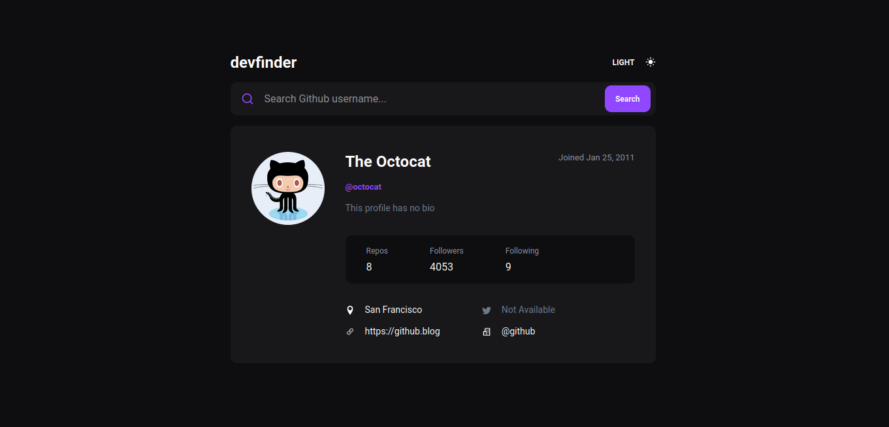
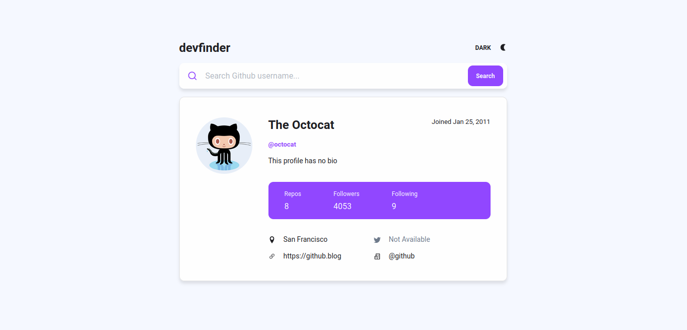

<div align="center">
  
  <h1>devfinder</h1>
</div>
<br>

## About devfinder

devfider is a simple and fast alternative for searching github users and seeing their main information.

## Theme
| Dark | Light |
:-------------------:|:-------------------:
|  | 

## Technologies

This project was development with the following technologies:

- [React](https://reactjs.org/)
- [TypeScript](https://www.typescriptlang.org/)
- [Sass](https://sass-lang.com/)
- [React Hot Toast](https://react-hot-toast.com/)

<br>

## How to run

```bash
# Clone the project and access its folder.
git clone https://github.com/erikalbuquerque/devfinder.git
cd devfinder

# To start it, follow the steps below:
# Install dependencies
yarn

# Start project
yarn start
```

<br>

:green_heart: by [Érik Albuquerque](https://github.com/erikalbuquerque)

<left>
  <h4>You can find me around here:</h4>

[](https://www.linkedin.com/in/erik-albuquerque/)
[](mailto:erik.albuquerque.oficial@gmail.com)
<a href="https://www.instagram.com/albuquerik">

</a>
<a href="https://app.rocketseat.com.br/me/erik-albuquerque">

</a>

</left>
